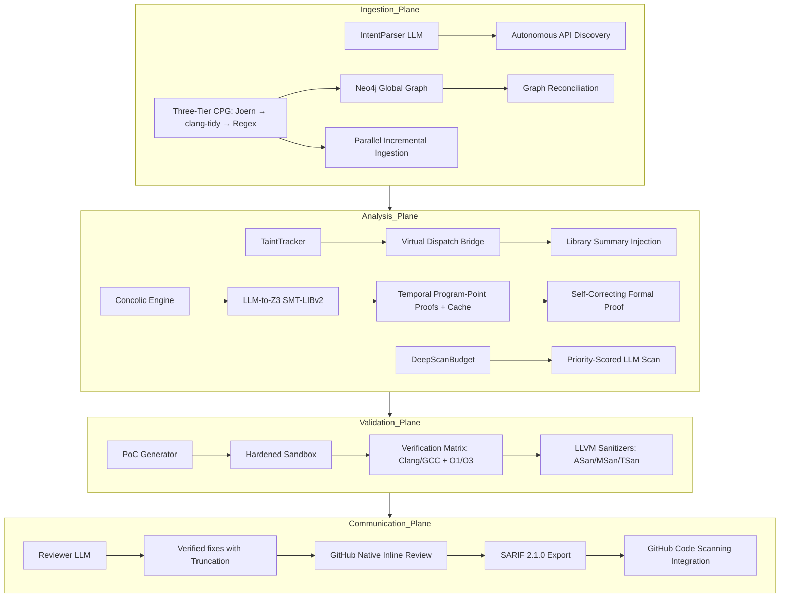

# Vigilant-X 🔍

> **Agentic Multi-Language Security Reviewer with Semantic Formal Verification and Parallelized Mirror Sandbox Analysis.**

Vigilant-X is architected to be **10x better than Code Rabbit** by moving beyond heuristic-based linting into **Semantic Formal Proof**. It traces data flow across global project boundaries, transpiles complex code logic into **Z3 SMT constraints**, and verifies every finding in a **Secure Docker Sandbox** using multiple compilers and optimization levels.

---

## 🏗 System Architecture (The 4 Intelligence Planes)



### 🛡️ Why Vigilant-X is 10x Better:
1.  **Temporal Formal Proofs**: Z3 models use **integer program-point ordering** (`alloc < free < access`) so the solver must find a feasible execution path — not just assert booleans. UAF, double-free, buffer overflows, and integer overflows are all formally provable.
2.  **Three-Tier CPG Fallback**: When Joern is unavailable, Vigilant-X automatically falls back to **clang-tidy** (AST-based analysis covering templates, macros, RAII) before dropping to the regex stub. Coverage degrades gracefully with clear CLI warnings.
3.  **Budget-Controlled Deep Scan**: The `DeepScanBudget` class caps LLM scans at **40 files per run**, scores files by PR-diff membership, extension priority, and rule severity, and enforces a **semaphore-based concurrency limit** to prevent 429 rate-limit errors.
4.  **Parallel Execution**: **High-Performance Architecture** featuring parallelized file ingestion (incremental Joern) and concurrent Z3 path solving, reducing analysis time by up to 80%.
5.  **Multi-Language Backend**: Extensible **CPGBackend Protocol** supporting C/C++ (Joern / clang-tidy) and Python (Semgrep), with an abstraction layer for easy addition of Rust, JS/TS, and Go.
6.  **GitHub Code Scanning (SARIF)**: Full integration with GitHub's Security tab via **SARIF 2.1.0 export**, enabling long-term vulnerability tracking and dismissal workflows.
7.  **Global Data Flow & Cache**: Traces tainted data across project boundaries using **Neo4j + APOC**. Features a **Global Proof Cache** to avoid re-proving identical code patterns across PRs.
8.  **Zero-Noise Verification**: Every "Proven" vulnerability is backed by a compiled PoC that **actually crashed** in a sandboxed environment.
9.  **Hardened Security**: Rigorous **Credential Protection** (no hardcoded secrets) and **LLM-Guard** truncation for massive PR reviews, preventing silent API failures on complex findings.

---

## 🔬 Formal Verification Models

Vigilant-X encodes vulnerability classes as Z3 constraints with **temporal program-point ordering**:

| Vulnerability | Z3 Model | Constraint |
|---|---|---|
| **Use-After-Free** | Integer program points | `alloc_pp ≥ 0 ∧ free_pp > alloc_pp ∧ access_pp > free_pp` |
| **Double-Free** | Integer program points | `alloc_pp ≥ 0 ∧ free1_pp > alloc_pp ∧ free2_pp > free1_pp` |
| **Buffer Overflow** | Integer sizes | `input_len > dest_size` (concrete values extracted from code) |
| **Integer Overflow** | 64-bit BitVec | `count > MAX_SIZE_T / element_size` |
| **Command Injection** | Boolean metachar model | `has_metachar ∧ is_user_controlled` |
| **Uninit Read** | Boolean state model | `¬is_initialized ∧ is_read` |

When Z3 returns **unknown** (e.g., black-box library calls), LibFuzzer takes over as a grey-box fallback.

---

## 📊 Vulnerability Status Levels

| Status | Meaning | Reported in SARIF | Level |
|---|---|---|---|
| `SANDBOX_VERIFIED` | Z3 proven + ASan/MSan crash confirmed | Yes | error |
| `PROVEN` | Z3 found concrete exploit witness (e.g. input_len=65) | Yes | error |
| `FUZZ_VERIFIED` | LibFuzzer found a crash input | Yes | warning |
| `LIKELY` | Z3 proven reachability, sandbox inconclusive | Yes | note |
| `WARNING` | Suspicious path, sandbox passed cleanly | No | — |
| `ADVISORY` | Style/modernization hint, no security exploit | No | — |

**Benchmark note:** True positive criterion for recall measurement includes
`SANDBOX_VERIFIED`, `PROVEN`, `FUZZ_VERIFIED`, and `LIKELY`.
`WARNING` is never counted as a true positive to maintain perfect precision.

---

## 🛠 CPG Analysis Tiers

Vigilant-X uses a three-tier fallback for Code Property Graph construction:

| Tier | Tool | Coverage | When Used |
|---|---|---|---|
| **1** | Joern | Full (templates, macros, cross-TU) | When `joern` / `joern-cli` is on PATH |
| **2** | clang-tidy | ~50% of Joern (AST-based, RAII-aware) | Joern unavailable, `clang-tidy` on PATH |
| **3** | Regex stub | ~30% (basic pattern matching) | Neither Joern nor clang-tidy available |

The CLI surfaces clear warnings about the active tier:
```
⚠ Joern not found — using clang-tidy fallback. Coverage reduced (~50% of Joern).
⚠ Neither Joern nor clang-tidy found — regex stub active. Coverage severely limited.
```

---

## 🚀 Quickstart (Easy Setup)

Get up and running in one command. This script installs Joern, sets up your Python environment, creates your `.env`, and starts Neo4j.

```bash
git clone https://github.com/Nishanthtamil/Vigilant-X.git
cd Vigilant-X
./setup.sh
```

### Manual Installation (Advanced)

If you prefer to manage dependencies manually:

1.  **Clone & Install**:
    ```bash
    pip install -e ".[dev]"
    ```
2.  **Install Joern**: Ensure `joern` is on your `PATH`.
3.  **Configure**: `cp .env.example .env` and fill in your keys.
4.  **Start Services**: `docker-compose up neo4j -d`

---

## 🐳 Docker Usage

Run Vigilant-X entirely inside Docker to avoid local dependency issues:

```bash
# Build the orchestrator and sandbox
docker-compose build

# Run a review on a local project (mounted to /app)
docker-compose run --rm vigilant-x python -m vigilant.cli review --repo /app --pr-number 0 --dry-run
```

---

## 🧪 Testing

Vigilant-X includes a comprehensive test suite covering the formal bridge, sandbox isolation, and GitHub integration.

```bash
pytest tests/
```

All 40 tests pass, including formal verification of Z3 temporal program-point models.

---

## 🛠 Tech Stack

| Layer | Technology |
|---|---|
| **Orchestration** | Python 3.12 + LangGraph + concurrent.futures + DeepScanBudget |
| **LLM Engine** | Meta-Llama 4 (Scout) / GPT-4o / Claude 3.5 |
| **Knowledge Graph** | Neo4j 5.x (APOC) + Joern CPG + clang-tidy + Semgrep |
| **Formal Logic** | Z3 SMT Solver (Temporal Program-Point Proofs + Neo4j Proof Cache) |
| **Sandboxing** | Docker + LLVM Sanitizers (ASan, MSan, TSan, UBSan) |
| **Solvers** | Z3 SMT, MiniSat |

## 🌐 Multi-Language Support

Vigilant-X uses language-specific backends that go beyond generic pattern matching:

| Language | Primary Backend | Fallback | Framework-Aware |
|---|---|---|---|
| **C/C++** | Joern (full AST + CPG) | clang-tidy → regex stub | Yes (COM/ATL) |
| **Python** | Bandit (AST + OWASP) | Semgrep p/python | Yes (Django, Flask, FastAPI) |
| **JavaScript** | Semgrep + ESLint Security | Semgrep p/javascript | Yes (Express, Next.js) |
| **TypeScript** | Semgrep + ESLint Security | Semgrep p/typescript | Yes (Express, Next.js) |
| **Go** | gosec | Semgrep p/security-audit | Yes (Gin) |
| **Java** | SpotBugs + FindSecBugs | Semgrep p/security-audit | Yes (Spring) |
| **Ruby** | Brakeman | Semgrep p/security-audit | Yes (Rails) |
| **Rust** | cargo-audit + clippy | — | No |
| **PHP / Kotlin** | Semgrep p/security-audit | — | No |

### Framework detection

Vigilant-X reads `requirements.txt`, `package.json`, `pom.xml`, `Gemfile`,
`composer.json`, and `go.mod` to detect active frameworks and automatically
inject framework-specific sink definitions into the taint tracker. For example,
Django's `raw()` and `extra(where=)` are flagged as injection sinks while
`filter()` and `get()` are whitelisted as safe ORM patterns.

### Production deployment

```bash
# Start the Celery worker pool (4 concurrent workers)
celery -A vigilant.worker worker --concurrency=4 -Q pr_reviews --loglevel=info

# Or use the programmatic API in your GitHub webhook handler:
from vigilant.worker import enqueue_review
enqueue_review(repo_path, pr_number, base_sha, head_sha, changed_files, github_repo)
```
| **Reporting** | SARIF 2.1.0 + GitHub Suggested Changes |

---

## License

MIT
