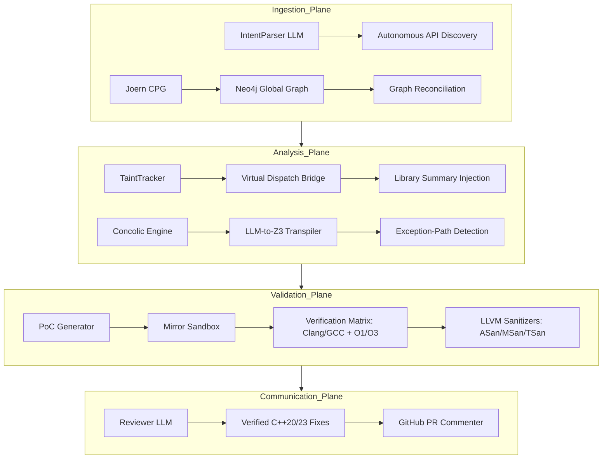

# Vigilant-X 🔍

> **Agentic C++ Security Reviewer with Semantic Formal Verification and Mirror Sandbox Analysis.**

Vigilant-X is architected to be **10x better than Code Rabbit** by moving beyond heuristic-based linting into **Semantic Formal Proof**. It traces data flow across global project boundaries, transpiles complex C++ logic into **Z3 SMT constraints**, and verifies every finding in a **Mirror Docker Sandbox** using multiple compilers and optimization levels.

---

## 🏗 System Architecture (The 4 intelligence Planes)



### 🛡️ Why Vigilant-X is 10x Better:
1.  **Semantic Formal Proof**: Unlike standard linters, Vigilant-X uses an **LLM-to-Z3 Bridge** to model C++ object lifetimes (RAII), smart pointers, and complex logic that typically blinds static analyzers.
2.  **Global Data Flow**: Uses **Neo4j + APOC** to trace tainted data across dozens of files and 30+ levels of function calls.
3.  **Zero False Positives**: Every "Proven" vulnerability is backed by a compiled PoC that **actually crashed** in a sandboxed environment.
4.  **Verification Matrix**: Executes PoCs across multiple compilers and optimization levels to catch bugs that only manifest at `-O3` or under specific compiler behaviors.
5.  **Autonomous API Discovery**: Automatically identifies project-specific dangerous APIs (Network, IO, custom logs) without manual configuration.

---

## 🚀 Quickstart

### 1. Clone & Install

```bash
git clone https://github.com/nishanth/Vigilant-X.git
cd Vigilant-X
pip install -e ".[dev]"
```

### 2. Configure

```bash
cp .env.example .env
# Required: GROQ_API_KEY (or OpenAI/Anthropic)
```

### 3. Start Infrastructure

```bash
docker-compose up neo4j -d
# Neo4j is mapped to Port 7688 to avoid conflicts
```

### 4. Run a Deep Security Review

```bash
vigilant-x review \
  --repo examples/ComBSTRDemo \
  --pr-number 0 \
  --dry-run
```

Expected output: Formal proof of a BSTR memory leak, an overwrite hazard, and a fully refactored C++20 fix using `CComBSTR` and `std::wstring_view`.

---

## 🧪 Testing

Vigilant-X includes a comprehensive test suite covering the LLM-Z3 bridge, Graph expansion, and Sandbox execution.

```bash
# Run all tests (all 19 tests must pass)
pytest tests/
```

---

## 🛠 Tech Stack

| Layer | Technology |
|---|---|
| **Orchestration** | Python 3.12 + LangGraph |
| **LLM Engine** | Meta-Llama 4 (Scout) / GPT-4o / Claude 3.5 |
| **Knowledge Graph** | Neo4j (APOC) + Joern CPG |
| **Formal Logic** | Z3 SMT Solver (via Dynamic Transpiler) |
| **Sandboxing** | Docker + LLVM Sanitizers (ASan, MSan, TSan, UBSan) |
| **Build Support** | `compile_commands.json` (Mirroring) |

---

## License

MIT
