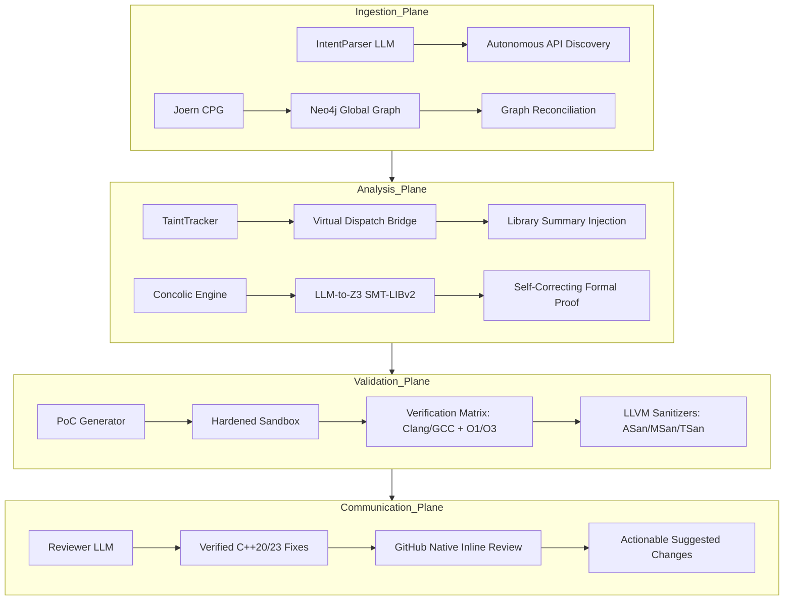

# Vigilant-X 🔍

> **Agentic C++ Security Reviewer with Semantic Formal Verification and Mirror Sandbox Analysis.**

Vigilant-X is architected to be **10x better than Code Rabbit** by moving beyond heuristic-based linting into **Semantic Formal Proof**. It traces data flow across global project boundaries, transpiles complex C++ logic into **Z3 SMT constraints**, and verifies every finding in a **Secure Docker Sandbox** using multiple compilers and optimization levels.

---

## 🏗 System Architecture (The 4 Intelligence Planes)



### 🛡️ Why Vigilant-X is 10x Better:
1.  **Formal Proof over Guesswork**: Vigilant-X uses a **Self-Correcting LLM-to-Z3 Bridge** that transpiles C++ to **SMT-LIBv2**. Findings are mathematically proven by the Z3 solver, not just "guessed" by an LLM.
2.  **Global Data Flow**: Traces tainted data across project boundaries using **Neo4j + APOC**, reaching 30+ levels of deep function calls.
3.  **Zero-Noise Verification**: Every "Proven" vulnerability is backed by a compiled PoC that **actually crashed** in a sandboxed environment.
4.  **GitHub Native Workflow**: Posts findings as professional **GitHub Reviews** with **Inline Comments** and **Suggested Changes**, allowing one-click remediation.
5.  **Verified Fixes**: Every suggested fix is **automatically re-verified in the sandbox** before being reported, ensuring the patch is effective and doesn't introduce regressions.
6.  **Security First Architecture**: Hardened against malicious repositories with a **Secure Sandbox** (ignores untrusted Dockerfiles) and a **Safe Formal Engine** (no `exec()` on LLM output).

---

## 🚀 Quickstart

### 1. Clone & Install

```bash
git clone https://github.com/nishanth/Vigilant-X.git
cd Vigilant-X
pip install -e ".[dev]"
```

### 2. Configure

```bash
cp .env.example .env
# Required: GROQ_API_KEY, GITHUB_TOKEN
```

### 3. Start Infrastructure

```bash
docker-compose up neo4j -d
```

### 4. Run a Deep Security Review

```bash
vigilant-x review \
  --repo owner/repo \
  --pr-number 123
```

---

## 🧪 Testing

Vigilant-X includes a comprehensive test suite covering the formal bridge, sandbox isolation, and GitHub integration.

```bash
pytest tests/
```

---

## 🛠 Tech Stack

| Layer | Technology |
|---|---|
| **Orchestration** | Python 3.12 + LangGraph |
| **LLM Engine** | Meta-Llama 4 (Scout) / GPT-4o / Claude 3.5 |
| **Knowledge Graph** | Neo4j (APOC) + Joern CPG |
| **Formal Logic** | Z3 SMT Solver (via SMT-LIBv2 Transpiler) |
| **Sandboxing** | Docker + LLVM Sanitizers (ASan, MSan, TSan, UBSan) |
| **GitHub Integration** | PyGithub (Review Threads + Suggested Changes) |

---

## License

MIT
