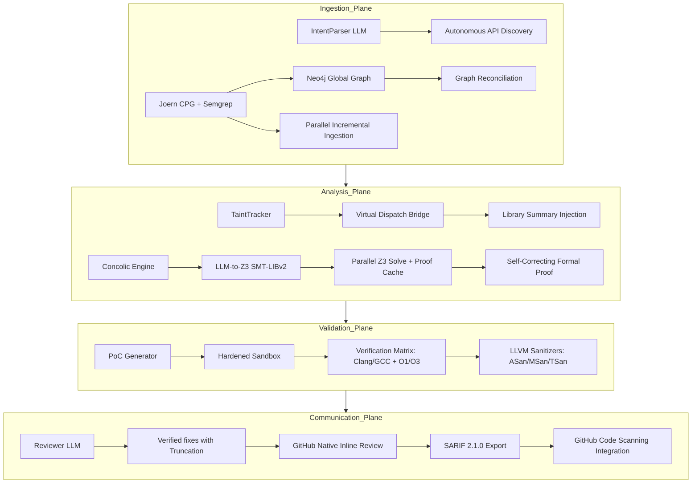

# Vigilant-X 🔍

> **Agentic Multi-Language Security Reviewer with Semantic Formal Verification and Parallelized Mirror Sandbox Analysis.**

Vigilant-X is architected to be **10x better than Code Rabbit** by moving beyond heuristic-based linting into **Semantic Formal Proof**. It traces data flow across global project boundaries, transpiles complex code logic into **Z3 SMT constraints**, and verifies every finding in a **Secure Docker Sandbox** using multiple compilers and optimization levels.

---

## 🏗 System Architecture (The 4 Intelligence Planes)



### 🛡️ Why Vigilant-X is 10x Better:
1.  **Formal Proof over Guesswork**: Vigilant-X uses a **Self-Correcting LLM-to-Z3 Bridge** that transpiles code to **SMT-LIBv2**. Findings are mathematically proven by the Z3 solver, not just "guessed" by an LLM.
2.  **Parallel Execution**: **High-Performance Architecture** featuring parallelized file ingestion (incremental Joern) and concurrent Z3 path solving, reducing analysis time by up to 80%.
3.  **Multi-Language Backend**: Extensible **CPGBackend Protocol** supporting C/C++ (Joern) and Python (Semgrep), with an abstraction layer for easy addition of Rust, JS/TS, and Go.
4.  **GitHub Code Scanning (SARIF)**: Full integration with GitHub's Security tab via **SARIF 2.1.0 export**, enabling long-term vulnerability tracking and dismissal workflows.
5.  **Global Data Flow & Cache**: Traces tainted data across project boundaries using **Neo4j + APOC**. Features a **Global Proof Cache** to avoid re-proving identical code patterns across PRs.
6.  **Zero-Noise Verification**: Every "Proven" vulnerability is backed by a compiled PoC that **actually crashed** in a sandboxed environment.
7.  **Hardened Security**: Rigorous **Credential Protection** (no hardcoded secrets) and **LLM-Guard** truncation for massive PR reviews, preventing silent API failures on complex findings.

---

## 🚀 Quickstart

### 1. Clone & Install

```bash
git clone https://github.com/nishanth/Vigilant-X.git
cd Vigilant-X
pip install -e ".[dev]"
```

### 2. Configure

```bash
cp .env.example .env
# Required: GROQ_API_KEY, GITHUB_TOKEN, NEO4J_PASSWORD
```

### 3. Start Infrastructure

```bash
docker-compose up neo4j -d
```

### 4. Run a Deep Security Review

```bash
# Dry-run locally
vigilant-x review --repo . --pr-number 0 --dry-run

# Full CI integration
vigilant-x review --repo owner/repo --pr-number 123
```

---

## 🧪 Testing

Vigilant-X includes a comprehensive test suite covering the formal bridge, sandbox isolation, and GitHub integration.

```bash
pytest tests/
```

---

## 🛠 Tech Stack

| Layer | Technology |
|---|---|
| **Orchestration** | Python 3.12 + LangGraph + concurrent.futures |
| **LLM Engine** | Meta-Llama 4 (Scout) / GPT-4o / Claude 3.5 |
| **Knowledge Graph** | Neo4j 5.x (APOC) + Joern CPG + Semgrep |
| **Formal Logic** | Z3 SMT Solver (Parallel + Neo4j Proof Cache) |
| **Sandboxing** | Docker + LLVM Sanitizers (ASan, MSan, TSan, UBSan) |
| **Reporting** | SARIF 2.1.0 + GitHub Suggested Changes |

---

## License

MIT
